# ARTH DevOps Intern tasks


# Task 1 Notes

This tasks contains outputs and explanations for basic Linux setup including user creation, package installation, and system information.
## Create a New User
---

```bash
sudo adduser devopsuser
````
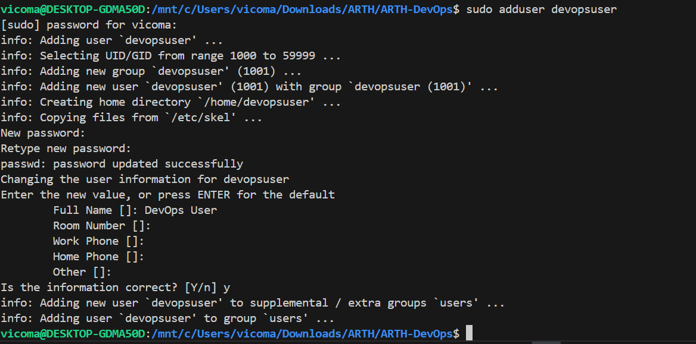
### What this command does:

* `sudo`: runs command as admin (superuser)
* `adduser`: creates a new user
* `devopsuser`: the username to be created

---

## Grant Sudo Access

```bash
sudo usermod -aG sudo devopsuser
```

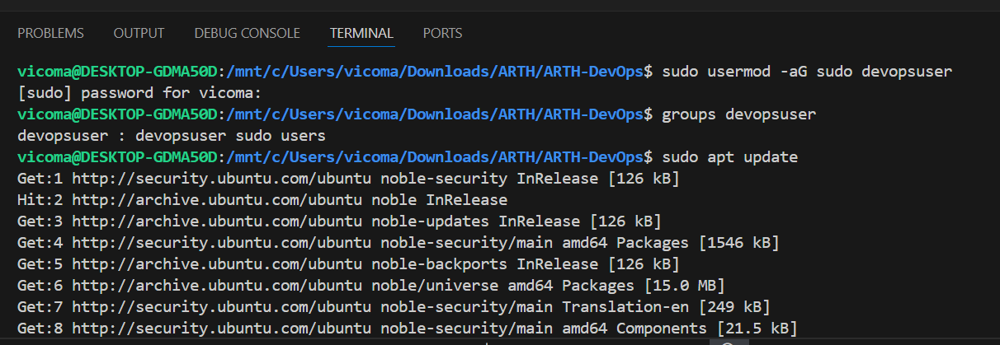

### What it means:

* `usermod`: modify user
* `-aG`: append to group
* `sudo`: admin group

This gives the user admin privileges.

---

## Verify User Group

```bash
groups devopsuser
```

Output should include:

```bash
sudo
```

---

## Update System

```bash
sudo apt update
```

### What it does:

* Fetches latest package lists from internet
* Ensures latest versions are installed

---

## Install Required Packages

```bash
sudo apt install -y git curl htop nginx docker.io
```

### Installs:

* `git` → version control
* `curl` → test APIs/web
* `htop` → system monitor
* `nginx` → web server
* `docker.io` → container tool

`-y` automatically confirms installation.

---

## System Information

### OS Version

```bash
lsb_release -a
```
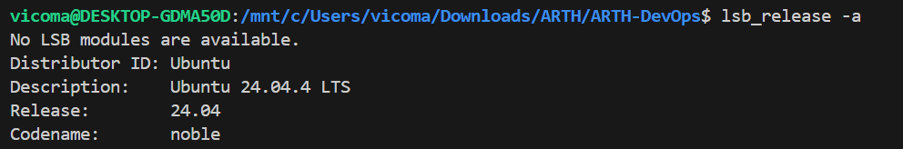

---

### IP Address

```bash
ip a
```
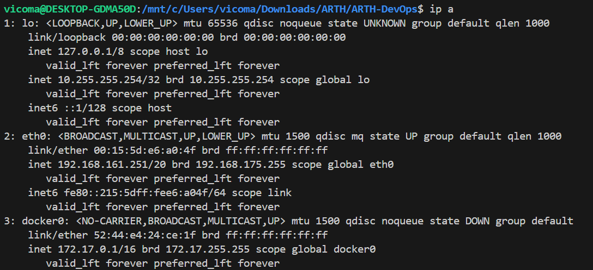

---

### Memory Usage

```bash
free -h
```
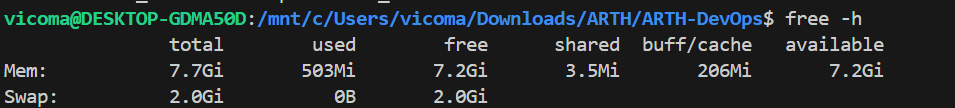

---

### Disk Usage

```bash
df -h
```
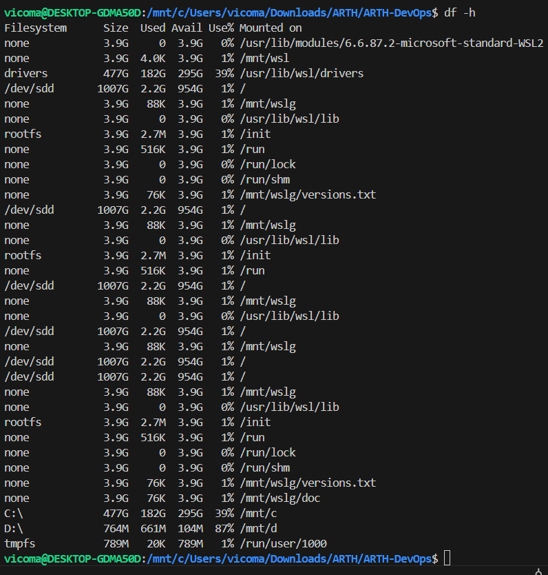


# Task 2 Notes

This section covers managing services in Linux, specifically starting, enabling, and troubleshooting nginx, as well as checking port usage.

---

## Start Nginx Service

```bash
sudo systemctl start nginx
````

### What this does:

* Starts the nginx web server immediately

---

## Enable Nginx on Boot

```bash
sudo systemctl enable nginx
```

### What this does:

* Ensures nginx starts automatically when the system boots

---

## Check Service Status

```bash
sudo systemctl status nginx
```
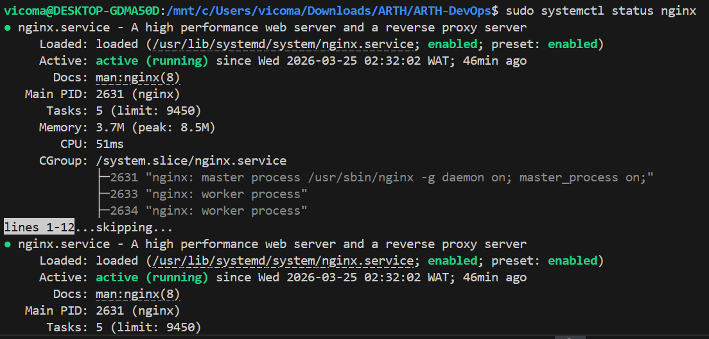

### What this does:

* Displays whether nginx is running or not
* Shows logs and any error messages

---

## Check Which Process is Using Port 80

```bash
sudo lsof -i :80
```
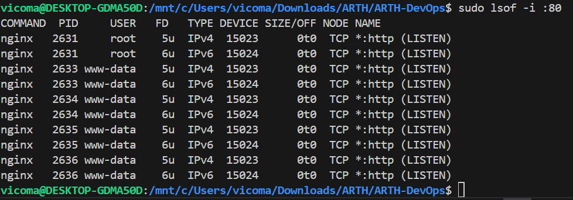

### What this does:

* Lists all processes currently using port 80 (HTTP port)
* Helps identify conflicts if nginx fails to start

---

## Alternative Method to Check Port Usage

```bash
sudo ss -tulnp | grep 80
```

### What this does:

* Displays active listening ports
* Filters output to show only port 80 usage

---

## Verification

To confirm nginx is working, open a browser and visit:

```
http://localhost
```
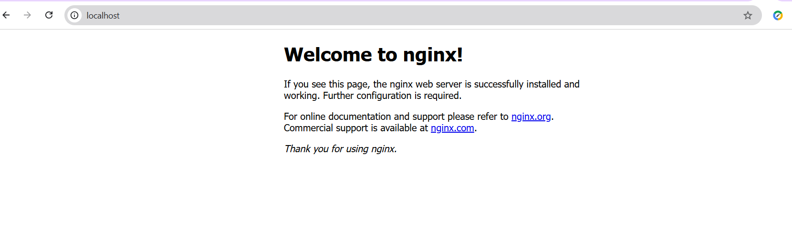

You should see the default nginx welcome page.

---


# Task 3 Notes
This section demonstrates how to create and run a simple web application using Docker, including building an image and exposing it via a port.

---

## Create Application Directory

```bash
mkdir myapp && cd myapp
````

### What this does:

* `mkdir myapp` → Creates a new directory named `myapp`
* `cd myapp` → Moves into the directory

---

## Create HTML File

```bash
nano index.html
```

### Add the following content:

```html
<h1>Hello from Docker Application</h1>
<p>This is the web app served inside a Docker container.</p>
```

### What this does:

* Creates a simple web page that will be served by nginx

---

## Create Dockerfile

```bash
nano Dockerfile
```

### Add the following content:

```dockerfile
FROM nginx:latest
COPY index.html /usr/share/nginx/html/index.html
```

### What this does:

* `FROM nginx:latest` → Uses nginx as the base image
* `COPY` → Replaces the default nginx web page with our custom page

---

## Build Docker Image

```bash
docker build -t myapp .
```
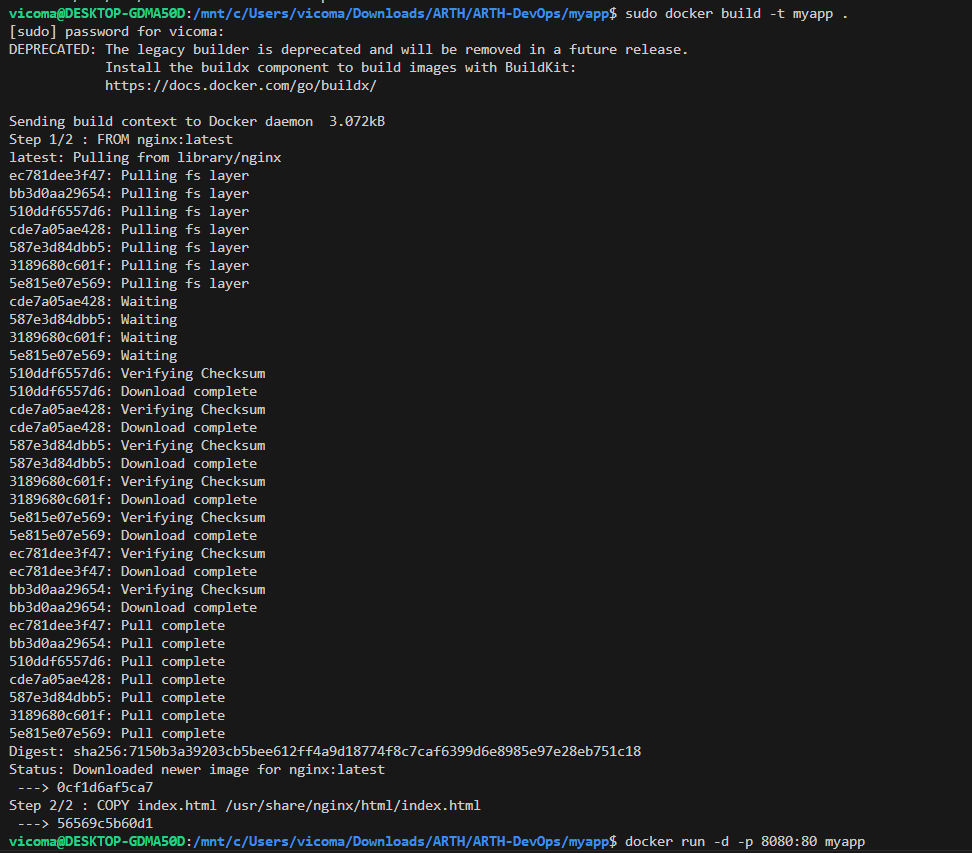

### What this does:

* Builds a Docker image from the Dockerfile
* `-t myapp` → Tags the image with the name "myapp"
* `.` → Uses the current directory as build context

---

## Run Docker Container

```bash
docker run -d -p 8080:80 myapp
```

### What this does:

* `-d` → Runs container in background (detached mode)
* `-p 8080:80` → Maps port 8080 (host) to port 80 (container)
* `myapp` → Name of the image to run

---

## Verify Running Container

```bash
docker ps
```
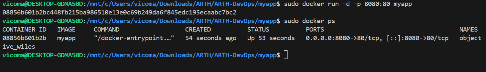

### What this does:

* Lists all running containers

---

## Verify Application in Browser

Open your browser and visit:

```
http://localhost:8080
```
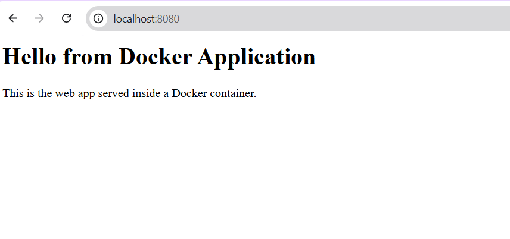

You should see:

```
Hello from Docker Application
This is the web app served inside a Docker container.
```

---


# Task 4 Notes

This section demonstrates how to configure nginx as a reverse proxy to forward incoming traffic from port 80 to an application running on port 8080.

---

## Edit Nginx Configuration File

```bash
sudo nano /etc/nginx/sites-available/default
````

### What this does:

* Opens the default nginx configuration file for editing

---

## Configure Reverse Proxy

Inside the `server` block, locate the `location /` section and replace it with:

```nginx
location / {
    proxy_pass http://localhost:8080;
}
```
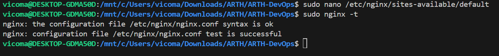

### What this does:

* Forwards all incoming requests on port 80 to the application running on port 8080
* Enables nginx to act as a reverse proxy

---

## Test Nginx Configuration

```bash
sudo nginx -t
```

### What this does:

* Checks for syntax errors in the nginx configuration file
* Ensures the configuration is valid before restarting

---

## Restart Nginx

```bash
sudo systemctl restart nginx
```

### What this does:

* Applies the new configuration changes

---

## Verify Application via Nginx

Open the browser and visit:

```
http://localhost
```
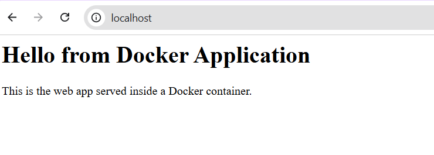

### Expected Result:

* The application running on port 8080 should now be accessible via port 80


# Task 5 Notes

This section documents a troubleshooting scenario encountered during the setup and how it was resolved.

---

## Issue Identified

The application was not accessible via the browser using:

```

http://localhost:8080

````
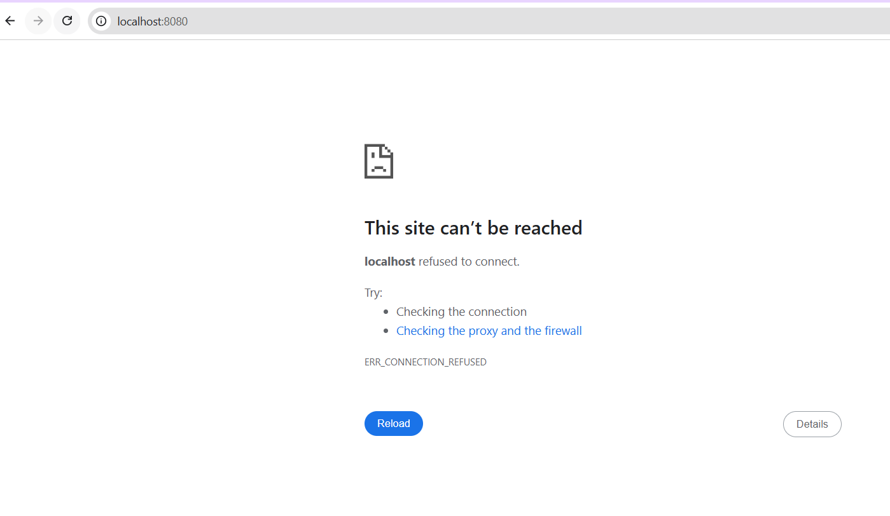

---

## Diagnosis

### Check Running Containers

```bash
docker ps
````
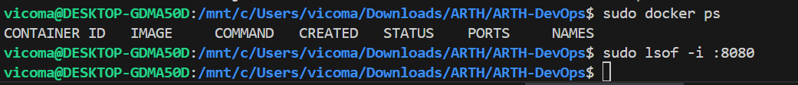

### What this does:

* Lists all running Docker containers
* Helps confirm whether the application container is active

---

### Check Port Usage

```bash
sudo lsof -i :8080
```

### What this does:

* Checks if port 8080 is being used
* Helps identify port conflicts or inactive services

---

## Root Cause

* The Docker container was not running
  OR
* Incorrect port mapping was used when starting the container

---

## Fix Applied

### Start Existing Container

```bash
docker start <container_id>
```

### OR Run Container Correctly

```bash
docker run -d -p 8080:80 myapp
```

### What this does:

* Starts the container or runs it with correct port mapping
* Ensures the application is exposed properly

---

## Verification

### Test with Curl

```bash
curl http://localhost:8080
```
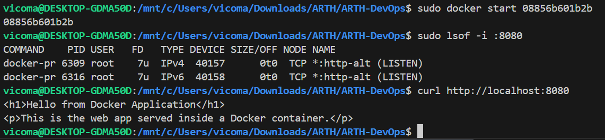

### What this does:

* Sends a request to the application
* Confirms it is responding correctly

---

### Browser Test

Open:

```
http://localhost:8080
```
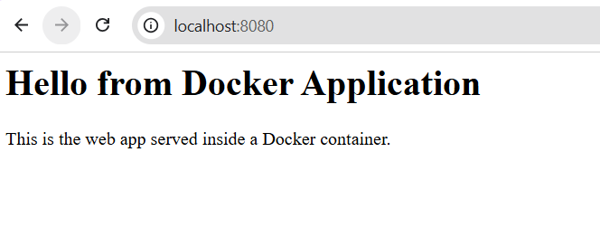


---

# Task 6 Notes

This section demonstrates creating a simple shell script to check system health, including disk usage, memory usage, nginx status, and application port availability.

---

## Create Script File

```bash
nano healthcheck.sh
````

### What this does:

* Creates and opens a new file named `healthcheck.sh` for editing

---

## Script Content

```bash
#!/bin/bash

echo "Disk Usage:"
df -h

echo "Memory Usage:"
free -h

echo "Nginx Status:"
systemctl status nginx | grep Active

echo "Application Port Check:"
ss -tulnp | grep 8080
```

---

## Explanation of Script

* `#!/bin/bash` → Specifies the script should run using Bash shell
* `echo` → Prints text to the terminal
* `df -h` → Shows disk usage in human-readable format
* `free -h` → Displays memory usage
* `systemctl status nginx | grep Active` → Shows nginx status (running or not)
* `ss -tulnp | grep 8080` → Checks if port 8080 is listening

---

## Make Script Executable

```bash
chmod +x healthcheck.sh
```

### What this does:

* Grants permission to execute the script

---

## Run Script

```bash
./healthcheck.sh
```

### What this does:

* Executes the script and displays system information

---

# Task 7 Notes

This section provides concise explanations of key DevOps concepts.

---

## Difference Between Docker Image and Container

- **Docker Image**:
  - A static blueprint or template used to create containers
  - Contains application code, libraries, and dependencies

- **Docker Container**:
  - A running instance of a Docker image
  - Executes the application in an isolated environment

---

## Difference Between systemctl start and systemctl enable

- **systemctl start**:
  - Starts a service immediately
  - Does not persist after reboot

- **systemctl enable**:
  - Configures a service to start automatically at system boot

---

## What is Nginx Reverse Proxy Used For?

- Nginx reverse proxy is used to:
  - Forward client requests to backend servers
  - Improve performance through load distribution
  - Enhance security by hiding backend services

---

## How to Check Which Process is Using a Port in Linux

```bash
lsof -i :PORT
````

### Example:

```bash
lsof -i :80
```

### What this does:

* Displays the process using a specific port

---

## What is AWS EC2 Used For?

* Amazon EC2 is used to:

  * Launch virtual servers in the cloud
  * Host applications and services
  * Provide scalable computing capacity

---

## What is Jenkins Used For?

* Jenkins is an automation server used for:

  * Continuous Integration (CI)
  * Continuous Deployment (CD)
  * Automating build, test, and deployment processes

---

## What is CodePipeline?

* AWS CodePipeline is a service used to:

  * Automate software release processes
  * Build, test, and deploy applications automatically
  * Integrate with other AWS services and CI/CD tools

````
